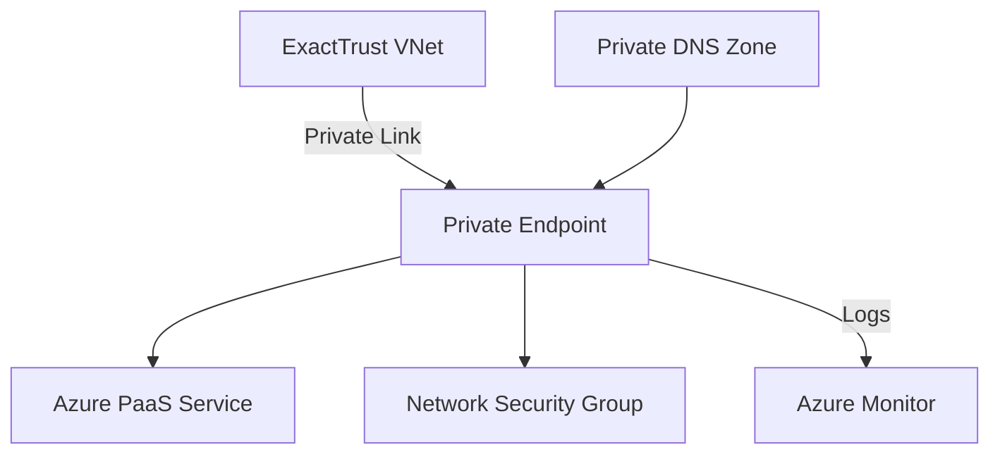
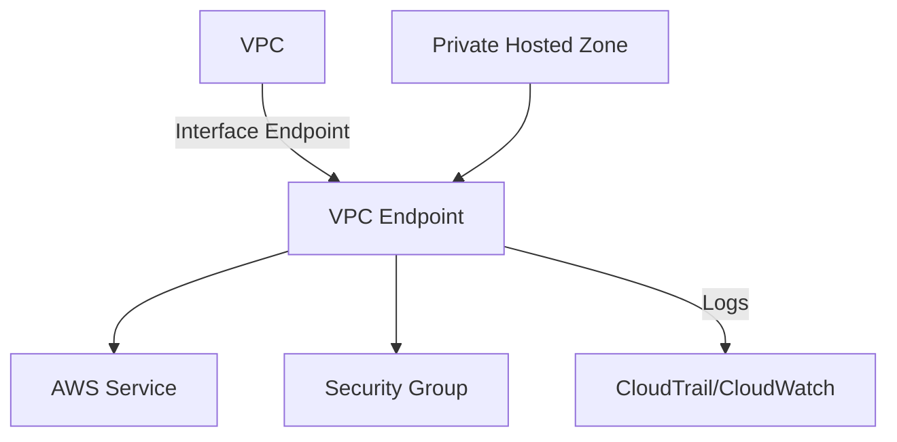

# Private Endpoint Security Pattern for ExactTrust

This document outlines the security pattern and requirements for implementing Private Endpoints across Azure and AWS for **ExactTrust**. It is written in Markdown to allow copy/paste into Confluence.

## Overview

Private Endpoints allow resources to be accessed securely over a private IP address within your virtual network, eliminating exposure to the public internet. The pattern ensures consistent security controls for both Azure and AWS environments.

**Key goals:**
1. Restrict public access to critical services.
2. Enforce consistent identity and access management.
3. Enable auditability and monitoring across clouds.
4. Support the "least privilege" principle for network and identity access.

---

## Design Principles

1. **Zero Trust Networking**: Assume no implicit trust; all access is explicitly granted and logged.
2. **Central Governance**: Use centralized policies and network segmentation to manage Private Endpoints across subscriptions/accounts.
3. **Defense in Depth**: Combine network isolation, IAM policies, and encryption for layered protection.
4. **Automated Compliance**: Leverage automation to enforce tagging, logging, and policy checks during provisioning.

---

## Azure Private Endpoint Pattern

### Required Components
- **Virtual Network (VNet)** where the Private Endpoint resides.
- **Private DNS Zone** linked to the VNet for name resolution.
- **Subnet** dedicated to Private Endpoints (recommended).
- **Network Security Group (NSG)** applying inbound/outbound rules.
- **Azure Monitor / Log Analytics** for auditing connections.

### Implementation Steps
1. **Define Subnets and NSGs**
   - Create a dedicated subnet for Private Endpoints.
   - Associate NSG with restrictive rules (deny all inbound, allow specific service endpoints).
2. **Create Private DNS Zone**
   - For each PaaS service (e.g., `blob.core.windows.net`, `database.windows.net`), create a zone and link it to the VNet.
3. **Deploy Private Endpoint via ARM/Terraform**
   - Use automation to deploy Private Endpoints with tags identifying environment and owner.
4. **Approve Connection**
   - Implement an approval process (manual or automated) for Private Link service connections.
5. **Monitor and Audit**
   - Enable diagnostics on the Private Endpoint and associated resources (e.g., Storage Account, SQL DB).
   - Centralize logs in Log Analytics.

### Diagram (Mermaid)

---

## AWS Private Endpoint Pattern (VPC Interface Endpoint)

### Required Components
- **VPC** with subnets for Private Endpoints.
- **VPC Endpoint (Interface type)** connected to AWS services (e.g., S3, Secrets Manager).
- **Security Group** controlling access to the endpoint network interface.
- **Private Hosted Zone (Route 53)** for internal DNS.
- **CloudTrail/CloudWatch Logs** for auditing.

### Implementation Steps
1. **Create Dedicated Subnet & Security Group**
   - Use a dedicated subnet (or multiple subnets across AZs) for endpoints.
   - Security group should allow only specific traffic from trusted sources.
2. **Provision the VPC Endpoint**
   - Deploy using CloudFormation/Terraform.
   - Enable private DNS for the service to automatically create Route 53 entries.
3. **IAM and Access Control**
   - Attach VPC endpoint policies limiting which AWS principals can use the endpoint.
   - Enforce IAM roles for applications using the endpoint.
4. **Monitoring**
   - Capture CloudTrail events for endpoint creation/usage.
   - Configure CloudWatch Logs/metrics for the underlying service.

### Diagram (Mermaid)

---

## Common Requirements for ExactTrust

1. **Tagging Standards**
   - `Environment`, `Owner`, `DataSensitivity`, and `Compliance` tags mandatory on all endpoint resources.
2. **Approval Workflow**
   - Private Endpoint requests must be reviewed by the ExactTrust cloud security team.
3. **Logging & Monitoring**
   - All access logs are centralized into the ExactTrust SIEM for analysis.
4. **Network Isolation**
   - Endpoints reside in dedicated subnets with no internet route.
5. **Least Privilege IAM**
   - Applications accessing the endpoint must use scoped IAM roles.
6. **Encryption**
   - Enforce TLS for all service connections.
7. **Periodic Review**
   - Perform quarterly audits of endpoints and connected services to ensure compliance.

---

## Sample Confluence Table

| Cloud | Component | Security Control |
|-------|-----------|------------------|
| Azure | Private Endpoint | NSG rules, Private DNS Zone, Log Analytics |
| Azure | Subnet | Dedicated + no public route |
| AWS | VPC Endpoint | Security Group, Endpoint Policy, Route 53 |
| AWS | Subnet | Dedicated + restricted |

---

## Operational Guidance for ExactTrust Teams

1. **Use Terraform Modules**
   - Adopt standardized Terraform modules for both Azure and AWS endpoint deployments.
2. **CI/CD Integration**
   - Integrate security checks into pipelines to validate tagging, IAM policies, and NSG/SG rules.
3. **Incident Response**
   - Funnel logs to the ExactTrust SOC for continuous monitoring and set up alerts for anomalous access patterns.
4. **Documentation & Training**
   - Maintain up-to-date runbooks in Confluence for engineers provisioning or troubleshooting endpoints.

---

## Summary

By following this pattern, **ExactTrust** can securely consume cloud services over private networks while ensuring consistent controls across Azure and AWS. Deploying Private Endpoints with strong governance, monitoring, and least privilege access helps minimize exposure and aligns with ExactTrust security policies.

